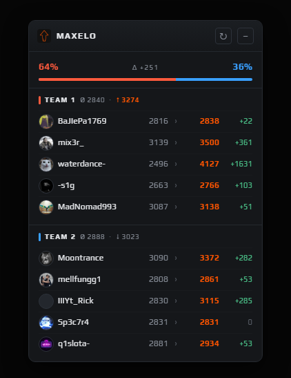

# Faceit MaxElo

A small Chrome extension that adds a widget to every Faceit CS2 match room showing the **highest ELO each player has ever reached**, not just their current one.

  

## Why this is useful

Faceit's match room only shows each player's current ELO. That number hides a lot: a player sitting at 2500 today might have peaked above 3200, this extension reveals it.

MaxElo pulls each player's lifetime peak from [faceitanalyser.com](https://faceitanalyser.com) and shows it right there in the match room, so you can see at a glance:

- Who on your team has played at a much higher level before.
- Whether the enemy team is stronger than their current ELO suggests.
- A rough win-chance estimate for each team, based on peak ELO averages.

## Install

1. Download this folder (Code → Download ZIP, then unzip).
2. Open Chrome and go to `chrome://extensions`.
3. Turn on **Developer mode** (top-right toggle).
4. Click **Load unpacked** and pick the unzipped folder.
5. Open any Faceit CS2 match room — the widget appears automatically.

## A note on speed

The first time a player appears, their peak ELO has to be fetched from the web. Results are saved locally for a week. The little `↻` button in the widget header forces a refresh for everyone in the current match.

## Privacy

- Your Faceit session is used only to read the match you're already looking at.
- Nothing is sent to any server the extension owns — there isn't one.
- Peak-ELO lookups go straight to faceitanalyser.com anonymously, and the result is cached in your browser.

## Tech details

- Manifest V3 Chrome extension, no frameworks, no build step.
- `background.js` fetches the Faceit match API and scrapes the lifetime "Highest ELO" value from faceitanalyser.
- `content.js` injects the widget, handles dragging and minimizing.
- Cache lives in `chrome.storage.local` (7 days for found players, 1 day for missing/private profiles).
- Win chance uses the adjusted (1000 scale) Elo expected-score formula on team peak-ELO averages.

## Assisted by

Built with help from **Claude Opus 4.7** (Anthropic) via Claude Code.
